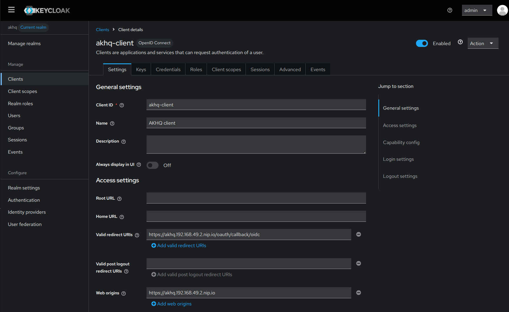
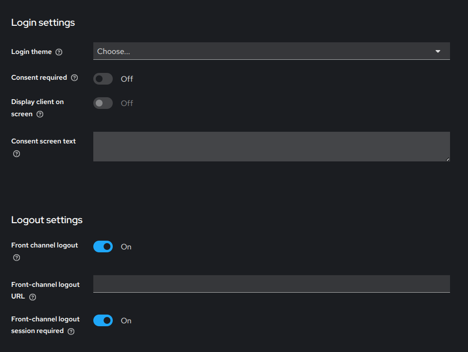
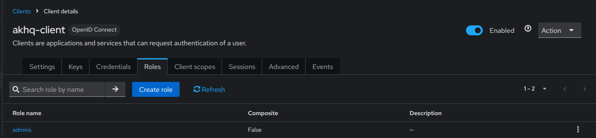
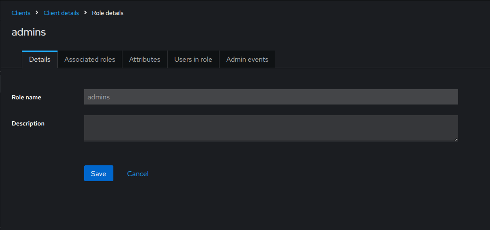
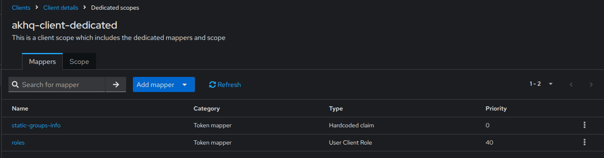
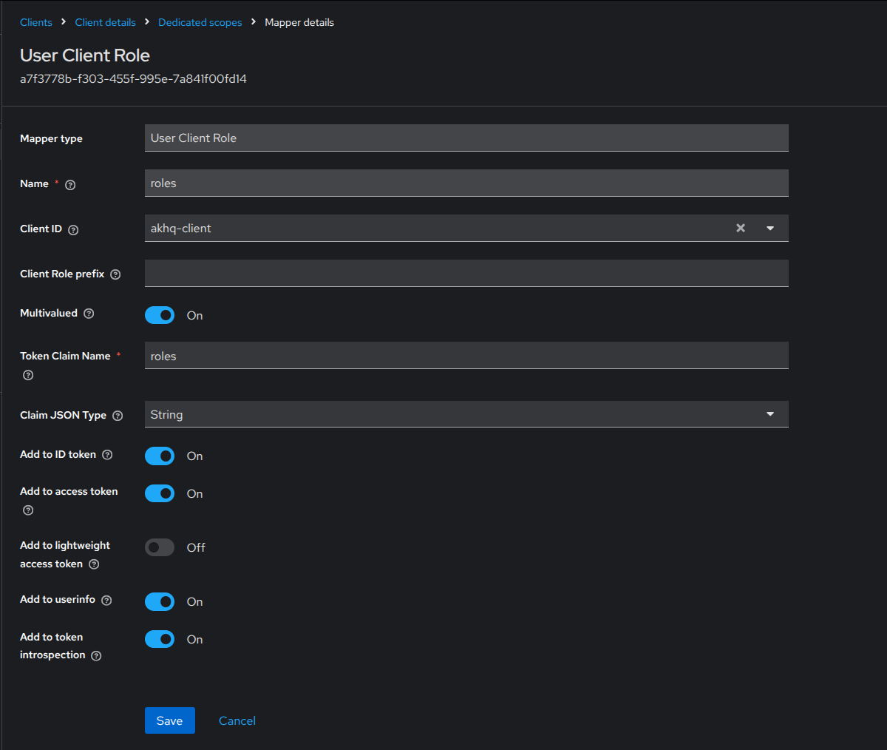
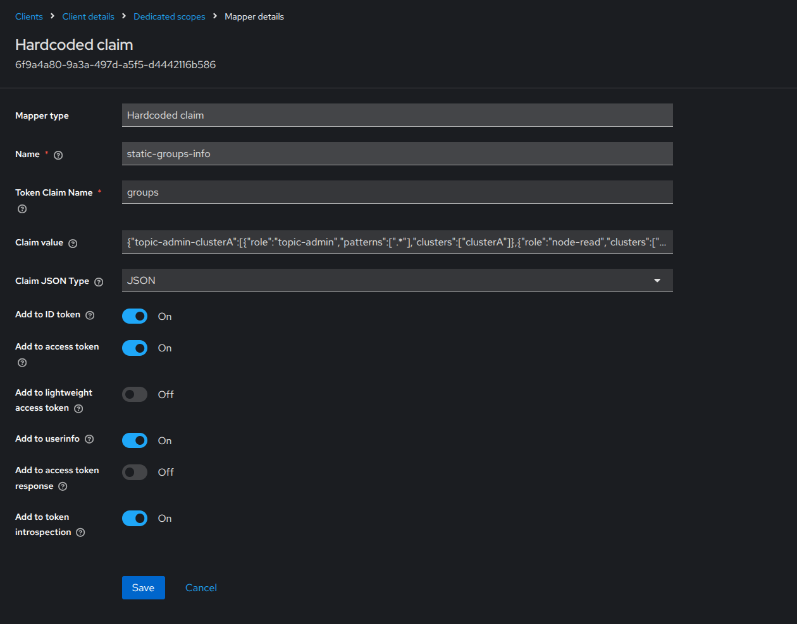
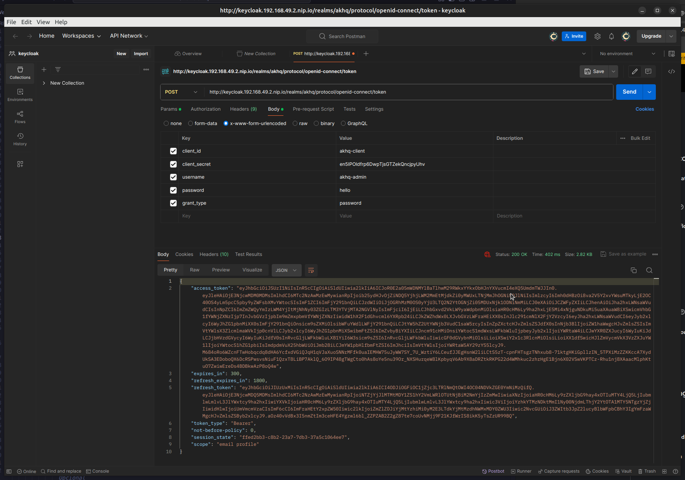

# Kafka, akhq & keycloak

Ejemplo de despliegue y configuración de kafka con akhq con login OIDC sobre keycloak.

## Índice

* [Desplieuge kafka](#desplieuge-kafka)
* [Construcción del CR](#construcción-del-cr)
* [Desplieuge AKHQ](#desplieuge-akhq)
* [Prerrequisitos AKHQ](#prerrequisitoss)
* [Configuración del cliente en keycloak](#configuración-del-cliente-en-keycloak)
  * [Listado de roles](#configuración-de-los-mappers)
  * [Configuración de los mappers](#configuración-de-los-mappers)

* [Ejemplo desplieuge en local](#ejemplo-desplieuge-en-local)


## Desplieuge kafka

Mediante el uso de Strimzi operators

```bash
kubectl create namespace kafka
kubectl create -f 'https://strimzi.io/install/latest?namespace=kafka' -n kafka
```

Mediante el uso de Helm charts
```bash
helm install strimzi-cluster-operator oci://quay.io/strimzi-helm/strimzi-kafka-operator
## Indicando version especifica y numero de replicas
helm install strimzi-cluster-operator --set replicas=2 --version 0.35.0 oci://quay.io/strimzi-helm/strimzi-kafka-operator
```

Kafka 4.0 en adelante solo acepta KRaft. 

## Construcción del CR

Para facilitar el despliegue y evitar empezar desde cero, Strimzi incluye una colección oficial de [archivos de configuración de ejemplo](https://github.com/strimzi/strimzi-kafka-operator/tree/0.49.1/examples/kafka). Estos archivos contienen las propiedades esenciales mínimas requeridas y están diseñados para servir como punto de partida (starting point) sobre el cual construir configuraciones más complejas.

Una vez que el Cluster Operator está en ejecución, es necesario proporcionarle las instrucciones específicas para construir el clúster. Esto se realiza aplicando un Custom Resource (CR).

El operador detectará este nuevo recurso en el namespace y comenzará el proceso de reconciliación para desplegar los brokers, KRaft (o Zookeeper) y servicios necesarios según la configuración definida. El siguiente comando aplica una configuración básica de un solo nodo, ideal para entornos de desarrollo, utilizando los ejemplos oficiales de Strimzi:

```bash
kubectl apply -f https://strimzi.io/examples/latest/kafka/kafka-single-node.yaml -n kafka 
```

## Desplieuge AKHQ

### Prerrequisitos

Toda instancia de ahkq precisa de su correspondiente fichero de configuración. En el caso que nos ocupa se integra dentro del values.yaml del chart.

A continuación, se detallan los segmentos esenciales para establecer la conectividad con el cluster de kafka y habilitar la autenticación OpenID Connecto (OIDC) con keycloak. El siguiente fragmento de código está extraído del values.yaml del helm chart proporcionado, el cual está basado en el [helm char de ejemplo](https://github.com/tchiotludo/akhq/tree/dev/helm/akhq/templates) oficial de akhq.

```yaml
configuration: 
  akhq:
    connections:
      hm-kafka:
        properties:
          bootstrap.servers: my-cluster-kafka-bootstrap:9092  # <-- (1) Boostrap server de kafka

    security:   # <--   (2) Configuración de seguridad
      default-group: no-roles   # <-- (3) Grupo por defecto para usuarios anónimos
      roles:    # <-- (4) Definicion de roles                      
        topic-admin:  # <-- (5) Nombre del rol junto con el listado de permisos
          - resources: [ "TOPIC", "TOPIC_DATA"]
            actions: [ "READ", "CREATE", "DELETE" ]
          - resources: ["CONSUMER_GROUP", "CONNECT_CLUSTER"]
            actions: ["READ"]  
          - resources: [ "TOPIC" ]
            actions: [ "UPDATE", "READ_CONFIG", "ALTER_CONFIG" ]
        node-read:
        - resources: [ "NODE" ]
          actions: [ "READ", "READ_CONFIG" ]
      groups: # <-- (6) Definición de grupos ad hoc
        topic-admin-clusterA:  # <-- (7) Nombre del grupo          
          - role: topic-admin         # <-- (8) rol asociado 
            patterns: [".*"]          # <-- (9) opcional, lista de expresines regulares para filtrado de los recursos accesibles
            cluster: ["clusterA"]     # <-- (10) opcional, lista de expresiones regulares para filtrado de llos clusters
          - role: node-read
            cluster: ["public"]
        enabled: true  # <-- (11) Habilita la seguridad, de lo contrario el acceso es permitido sin autorización
        providers:  # <-- (12) Lista de providers
          oidc: # <-- (13) Nombre del provider
            label: "Login with Keycloak"  # <-- (14) Texto mostrado en el boton de login
            username-field: preferred_username  # <-- (15) nombre del campo del JWT que contiene el nombre de usuario
            # default-group: no-roles # <-- (16) Grupo por defecto para usuarios autenticados, en caso contrario se aplica (3)
            use-oidc-claim: false  # <-- (17) Delega la gestión de roles y atributos en el proveedor OIDC. Su activación implica eliminar la parte (6)
            # groups-field: groups # <-- (18) En caso de (17) sea true, indica el nombre del campo en el token JWT que contiene la información de grupos 
            groups: # <-- (19) Definición de mappers entre el rol indicado en el token JWT y el grupo definido.
              - name: admins  # <-- (20) Role en el JWT
                groups: # <-- (21) Listado de grupos mapeados
                  - topic-admin-clusterA #  <-- (22) se corresponde con (7)

  micronaut:  # <-- (23) Configuración OIDC en micronut
    security:
      enabled: true # <-- (24) Habilita la seguridad
      oauth2:
        clients:  # <-- (25) Listado de clientes
          oidc: # <-- (26) Nombre definido en (13)
            client-id: "akhq-client"  # <-- (27) Nombre del cliente en keycloak
            client-secret: "en5IPOldfrp6DwpTjsGTZekQncjpyUhv" # <-- (28) Secreto del cliente en keycloak
            openid:
              issuer: "https://keycloak.192.168.49.2.nip.io/realms/akhq" # <-- (29) Url del issuer
              # configuration-path: "http://keycloak.kafka.svc.cluster.local:8080/realms/akhq/.well-known/openid-configuration" # <-- Opcional
              # jwks-uri: "http://keycloak.kafka.svc.cluster.local:8080/realms/akhq/protocol/openid-connect/certs" # <-- Opcional
    caches:
      local-security-claim-provider:
        expire-after-write: 600s 
```

La lista con los recursos y los permisos aplicables a cada recurso [aquí](https://akhq.io/docs/configuration/authentifications/groups.html)


### Configuración del cliente en keycloak




### Listado de roles

Listado de los roles para el cliente. Para el caso que nos ocupa sólo es necesaria la creación del rol asignándole un nombre.




### Configuración de los mappers



- **roles**: listado de roles vinculados al usuario. Campo empleado en el mapper de akhq (19).
- **static-groups-info**: campo opcional referencia al punto (18) de la configuración. Campo estático que contiene un json con el conjuto de grupos, roles asociados, patrones para recursos y clusters. Estos últimos opcionales.




Para probar el token podemos emplear postman activando la casilla direct access grants en el cliente y empleando postman o curl.



## Ejemplo desplieuge en local

Se adjunta guía de ejempo de despligue en entorno local de kafka, akhq y keycloak [ir al readme de configuración](./local-helm-akhq/README.md).

[Video ejemplo de login en desplieuge local sobre minikube](./assets/keycloak-akhq-login.mp4)


